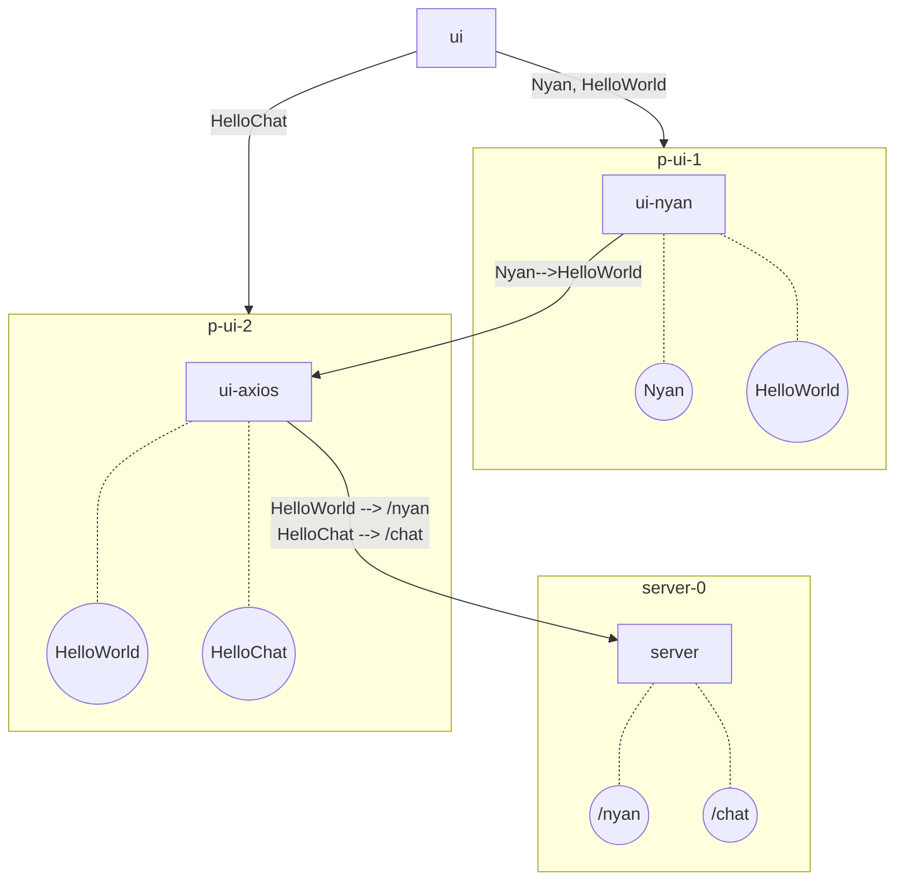

# monorepo (+nyan)

## Pre-requisites

- nvm
- vsc
- git

## Setup

1. Clone the repository `git clone https://github.com/lmhinnel/monorepo.git`
2. Run `nvm use` to use the correct node version
3. Run `yarn set version berry` for fun (pnp)
4. Run `yarn run dev` to start the development server/ui (+ plugins)

## Access

- Server:   [http://localhost:8080/](http://localhost:8080/)
- UI:       [http://localhost:5173/](http://localhost:5173/)

## Structure
```bash
.
├── packages
├────── server      (backend)
├────── ui          (frontend)
├── plugins
├────── ui-nyan     (ui plugin)
├────── ui-axios    (ui plugin)
└── yarn.lock
```



## Check var

| Workspace  | Description                  |
| ---------- | ---------------------------- |
| `ui`       | antd v4 (modal use :open)    |
| `ui-nyan`  | antd v3 (modal use :visible) |
| `ui-axios` | antd v4                      |

## Development

```bash
nvm use // use node version
# node -v > .nvmrc // save node version
yarn set version berry // set yarn version
yarn // install dependencies
yarn create vite . // create ui app
yarn workspace ${workspace name} add ${package} // add package to workspace
```

## References

[https://fluorescent-tractor-48c.notion.site/Detail-abt-workspace](https://fluorescent-tractor-48c.notion.site/Detail-abt-workspace-1586c6e188a3803cb9d7ee48c4e1328e)